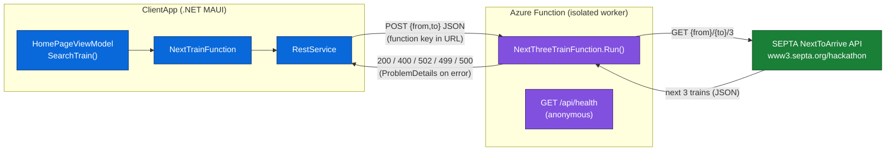
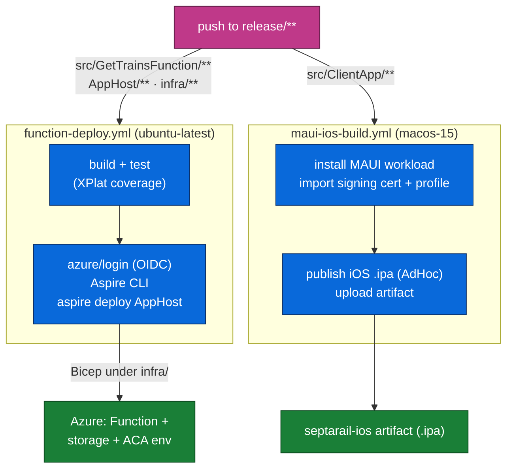

# SeptaRail — Next Three Trains

[](https://github.com/NavneetHegde/SeptaRail/actions/workflows/function-deploy.yml)
[](https://github.com/NavneetHegde/SeptaRail/actions/workflows/maui-ios-build.yml)

SeptaRail shows the next three SEPTA Regional Rail trains between two stations. It is built from two independently-deployed .NET 10 components, orchestrated locally with .NET Aspire:

- **`src/ClientApp`** — a .NET MAUI cross-platform app (Android, iOS, MacCatalyst, Windows). The mobile/desktop UI.
- **`src/GetTrainsFunction`** — an isolated-worker Azure Function (HTTP, v4) that proxies the public SEPTA "NextToArrive" hackathon API.

The ClientApp never calls SEPTA directly — it always calls the Azure Function, which in turn calls SEPTA.

## Runtime data flow



The Function returns specific status codes instead of swallowing errors: `400` for an empty/malformed body or missing stations, `502` when SEPTA is unreachable or returns a bad response, `499` if the caller cancels, and `500` for anything unexpected.

## CI/CD workflow

Both components deploy via GitHub Actions on pushes to `release/**` (path-filtered), replacing the old Azure DevOps pipelines.



## Local development

Run the Function and its dependencies under the Aspire dashboard (Azurite storage + OpenTelemetry), or run the Function on its own:

```bash
# Everything via Aspire (dashboard + Azurite + the Function)
aspire run AppHost/AppHost.cs

# Just the Function (needs Azure Functions Core Tools)
cd src/GetTrainsFunction && func start

# Tests
dotnet test test/GetTrainsFunction.Tests/GetTrainsFunction.Tests.csproj
```

The MAUI app multi-targets and must be built one TFM at a time:

```bash
dotnet build src/ClientApp/ClientApp.csproj -f net10.0-windows10.0.19041.0
dotnet build src/ClientApp/ClientApp.csproj -f net10.0-android
```

See [`CLAUDE.md`](./CLAUDE.md) for architecture details, build gotchas, and the full command reference, and [`docs/plan/`](./docs/plan/) for the Aspire integration plan.
